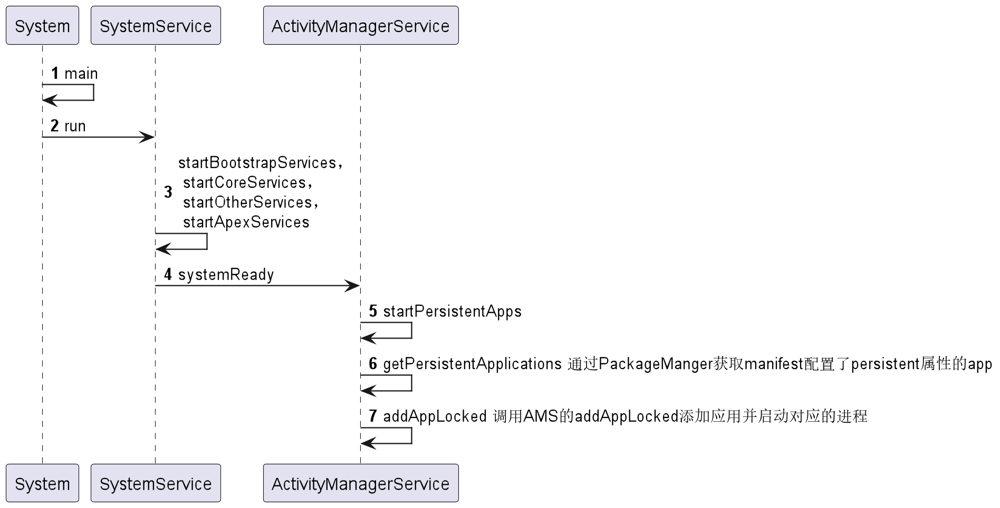

ps:基于api 33 分析

* persistent属性位于：platforms\android-33\data\res\values\attrs_manifest(我本地的目录)

```
  <!-- Flag to control special persistent mode of an application.  This should
         not normally be used by applications; it requires that the system keep
         your application running at all times. -->
    <attr name="persistent" format="boolean" />
```
* 控制应用程序特殊持久模式的标志，通常不会被应用程序使用;它会使系统保持您的应用程序一直在运行


### 特性
当app manifest配置了persistent时候，具备如下两个属性：</br>
1，当系统启动时，app 会被拉起</br>
2，当app被强制kill后，系统会重启该app（这种情况，只针对push 到system 目录下的app，第三方的app则不会）

### 使用
```
<application>
 android:persistent="true|false"
</application>
```

### 启动uml


### 代码流程分析

#### 一，SystemServer

1,zygote为我们启动SystemServer进程
```
    /**
     * The main entry point from zygote.
     */
    public static void main(String[] args) {
        new SystemServer().run();
    }

```


```

```

