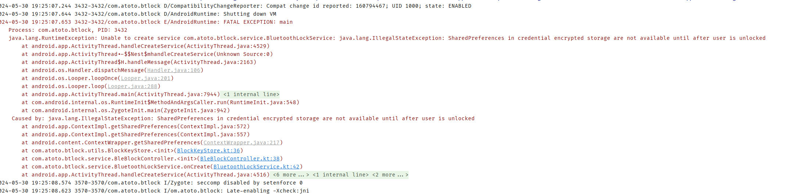

在AndroidO及以上平台上，一个应用使用了SharedPreference的apk，且TargetSdk设置大于等于26，如果在设备刚开机时（用户未解锁），调用getSharedPreferences就会导致crash，从错误提示也可以看出跟user locked有关。

参考：
https://blog.csdn.net/sui1005316018/article/details/122828193