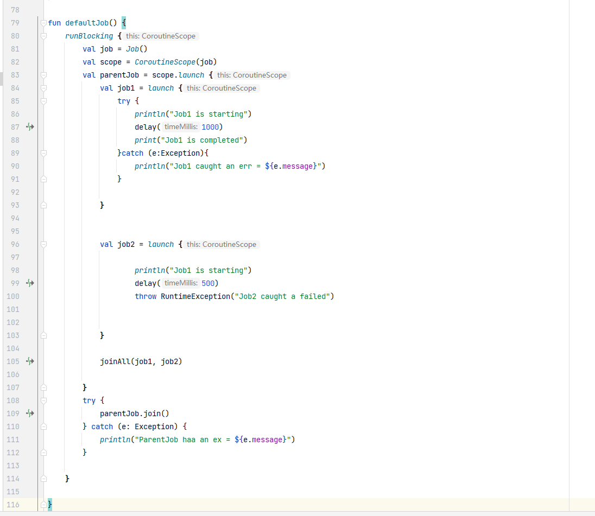
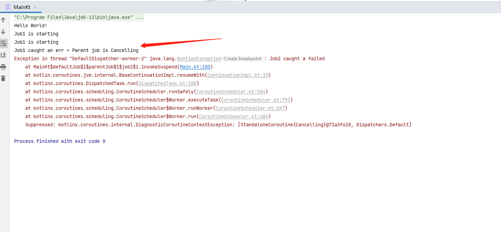
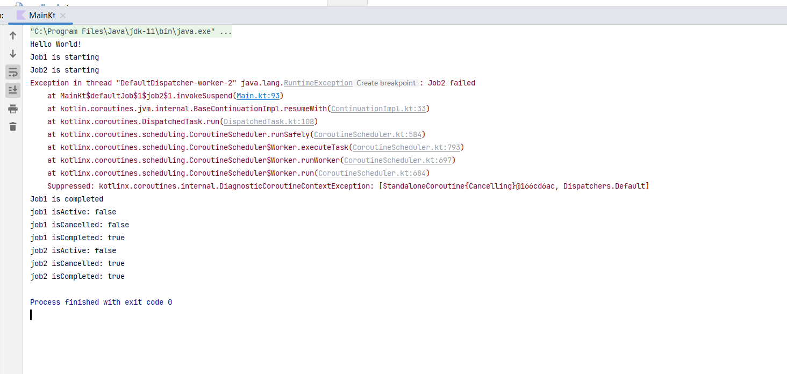
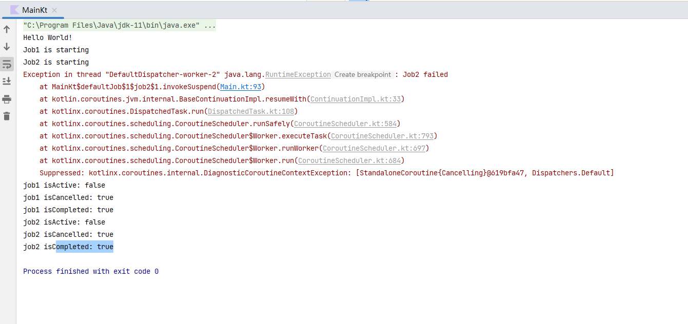

### 具体工作原理
协程层级结构：当一个协程通过 launch、async 等构建器启动时，它会继承当前作用域的 Job，形成一个父子关系。
异常传播：默认情况下，当一个子协程抛出未捕获的异常时，这个异常会传播到父协程的 Job，从而导致父协程也被取消。
取消传播：一旦父 Job 被取消，所有的子 Job 也会被取消。这是一个级联的过程，确保任何未处理的异常都不会被忽视。

```kotlin
import kotlinx.coroutines.*

fun main() = runBlocking {
    val parentJob = launch {
        val childJob = launch {
            throw RuntimeException("Child job failed")
        }
        childJob.join()
    }

    parentJob.join()
    println("Parent job is cancelled: ${parentJob.isCancelled}")
}
```
子协程 childJob 抛出了一个 RuntimeException，导致父协程 parentJob 被取消。

### 防止异常传播
如果你希望子协程的异常不会传播到父协程，可以使用 SupervisorJob 或 supervisorScope。SupervisorJob 是一种特殊的 Job，它不会因子协程的失败而取消自己或其他子协程。


### SupervisorJob和supervisorScope：
SupervisorJob：

适用于你想显式地创建具有监督功能的 Job，并将其添加到协程上下文中。
需要通过手动创建 CoroutineScope 来使用。
supervisorScope：

提供了一种更简便的方式来创建带有监督功能的作用域。
自动创建 SupervisorJob，使代码更简洁，减少了样板代码。
根据实际场景，你可以选择最合适的方案。如果你需要在已有的上下文中添加监督功能，可以选择 SupervisorJob；如果你想要的是一个临时且简洁的带有监督功能的作用域，那么推荐使用 supervisorScope。

#### 默认的Job



在这个情况下，job1 将会被取消，因为 job2 抛出了一个异常并且没有被捕获。另外，当取消发生时，job1 的 delay 会由于取消引发一个 CancellationException。



例子：

### SupervisorJob
```kotlin
 runBlocking {
         val supervisor = SupervisorJob()
    val scope = CoroutineScope(Dispatchers.Default + supervisor)

    val job1 = scope.launch {
        println("Job1 is starting")
        delay(1000)
        println("Job1 is completed")
    }

    val job2 = scope.launch {
        println("Job2 is starting")
        delay(500)
        throw RuntimeException("Job2 failed")
    }

    // 等待 job1 和 job2 完成
    joinAll(job1, job2)

    // 检查 job1 和 job2 的状态
    println("job1 isActive: ${job1.isActive}")
    println("job1 isCancelled: ${job1.isCancelled}")
    println("job1 isCompleted: ${job1.isCompleted}")

    println("job2 isActive: ${job2.isActive}")
    println("job2 isCancelled: ${job2.isCancelled}")
    println("job2 isCompleted: ${job2.isCompleted}")

```

输出：


### 默认Job

```kotlin
   runBlocking {
        val job = Job()
        val scope = CoroutineScope(Dispatchers.Default + job)

        val job1 = scope.launch {
            println("Job1 is starting")
            delay(1000)
            println("Job1 is completed")
        }

        val job2 = scope.launch {
            println("Job2 is starting")
            delay(500)
            throw RuntimeException("Job2 failed")
        }

        // 等待 job1 和 job2 完成
        joinAll(job1, job2)

        // 检查 job1 和 job2 的状态
        println("job1 isActive: ${job1.isActive}")
        println("job1 isCancelled: ${job1.isCancelled}")
        println("job1 isCompleted: ${job1.isCompleted}")

        println("job2 isActive: ${job2.isActive}")
        println("job2 isCancelled: ${job2.isCancelled}")
        println("job2 isCompleted: ${job2.isCompleted}")
    }
```

输出结果:


### 总结
默认 Job：一个子协程失败，整个作用域的所有子协程都会被取消。
SupervisorJob：一个子协程失败，其它子协程仍然会继续运行。
